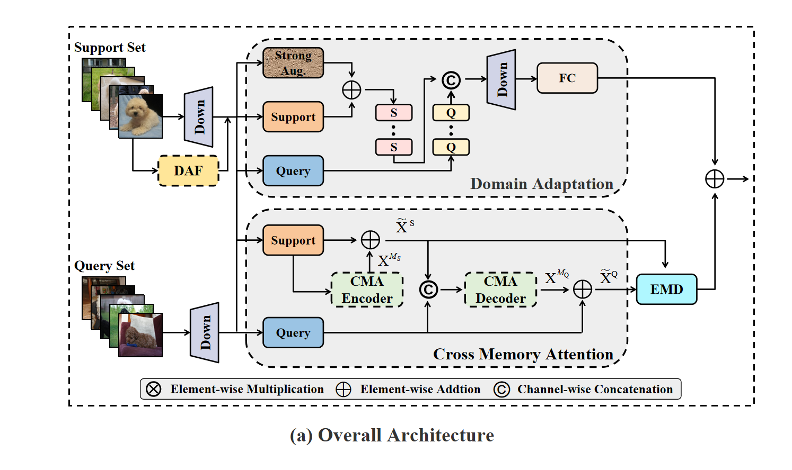

# CSM-Net: Relation Embedding for Few Shot Learning Optimized by Cross Memory Attention

This repository contains the official PyTorch implementation of:

**CSM-Net: Relation Embedding for Few Shot Learning Optimized by Cross Memory Attention**  
Wenqiang Xu, Junwen Liu, Xutao Sun, Yonggong Ren  
*Neural Networks*

[[Paper]](https://doi.org/xxx) 

<p align="center">
  
</p>

## Abstract

Few-shot learning is one of the core research directions in the field of machine learning, aiming to train models with extremely limited labeled samples, enabling them to generalize rapidly to unseen categories or tasks. The key challenges lie in effectively capturing the class-specific features and relationships between samples under limited supervision, and the impact of data perturbations becomes more pronounced in the few-shot setting. To address these two issues, we propose **Cross-Memory Attention (CMA)**, which extracts memory features from the support set and query set, by integrating the memory features of the support set into the query set, our method achieves long-range dependency modeling between the support and query sets while maintaining a lower parameter count compared to pure Transformers, thereby solving the problem of relationship modeling between samples. Additionally, the **Domain Adaptation (DA)** Module mitigates the impact of data perturbations by training an additional branch with perturbed data. The module is a learnable classification space, whose introduction overcomes the limitations of fixed, non-learnable metric learning in the classification space. To enable the use of our Cross-Memory Attention in 5-shot scenarios, we propose a **Multi-sample Adaptive Fusion (MAF)** Module that can be applied to any multi-sample learning framework. This module effectively extracts common features from multiple samples, making it versatile and adaptable. Finally, we conduct extensive experiments on four public datasets, validating the effectiveness of our model.

## Citation

If you find this code useful, please consider citing:

```bibtex
@article{xu2024csmnet,
  title={CSM-Net: Relation Embedding for Few Shot Learning Optimized by Cross Memory Attention},
  author={Xu, Wenqiang and Liu, Junwen and Sun, Xutao and Ren, Yonggong},
  journal={Neural Networks},
  year={2024},
  publisher={Elsevier}
}
```
